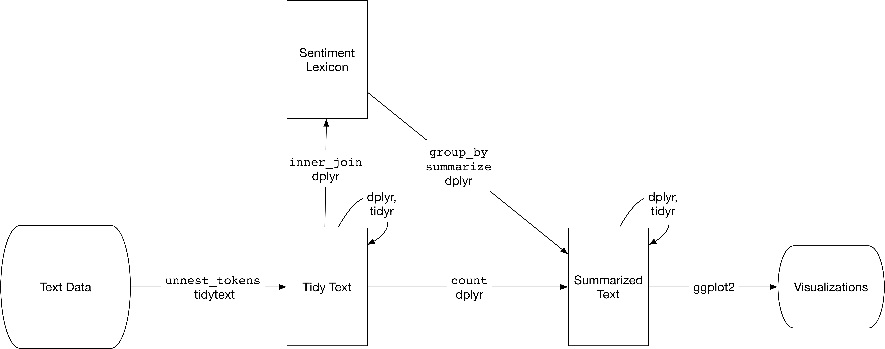

```{r setup, include=FALSE}
knitr::opts_chunk$set(echo = TRUE, warning=FALSE, message=FALSE)
```

# Introduction

This presentation is heavily based on the book Text Mining with R by Julia Silge and David Robinson. You can check it online [here](https://www.tidytextmining.com/) for free.

# Tidy data

Using tidy data principles is a powerful way to make handling data easier and more effective, and this is no less true when it comes to dealing with text. As described by Hadley Wickham (Wickham 2014), tidy data has a specific structure:

* Each variable is a column
* Each observation is a row
* Each type of observational unit is a table


# Tidy text data

We thus define the tidy text format as being a table with one-token-per-row. A token is a meaningful unit of text, such as a word, that we are interested in using for analysis, and tokenization is the process of splitting text into tokens. This one-token-per-row structure is in contrast to the ways text is often stored in current analyses, perhaps as strings or in a document-term matrix. For tidy text mining, the token that is stored in each row is most often a single word, but can also be an n-gram, sentence, or paragraph. In the tidytext package, we provide functionality to tokenize by commonly used units of text like these and convert to a one-term-per-row format.

Tidy data sets allow manipulation with a standard set of “tidy” tools, including popular packages such as dplyr (Wickham and Francois 2016), tidyr (Wickham 2016), ggplot2 (Wickham 2009), and broom (Robinson 2017). By keeping the input and output in tidy tables, users can transition fluidly between these packages. We’ve found these tidy tools extend naturally to many text analyses and explorations.

At the same time, the tidytext package doesn’t expect a user to keep text data in a tidy form at all times during an analysis. The package includes functions to tidy() objects (see the broom package [Robinson et al cited above]) from popular text mining R packages such as tm (Feinerer, Hornik, and Meyer 2008) and quanteda (Benoit and Nulty 2016). This allows, for example, a workflow where importing, filtering, and processing is done using dplyr and other tidy tools, after which the data is converted into a document-term matrix for machine learning applications. The models can then be re-converted into a tidy form for interpretation and visualization with ggplot2.

Let's get our hands dirt. That's a sample of Emily Dickinson's text.

```{r text as vector}
text <- c("Because I could not stop for Death -",
          "He kindly stopped for me -",
          "The Carriage held but just Ourselves -",
          "and Immortality",
          "I could stop the death")

text
```

At this moment, that text is just a character vector but let's make it a dataframe or in this case a tibble, through the function `tibble()`. In order to load this function to our R session, we need to import the library `dplyr`. A tibble is a more advanced version of a R dataframe. I encourage you to look up for that. I strongly recommend the book R for Data Science (2014) by Hadley Wickham. That book can be accessed for free [here](https://r4ds.had.co.nz/).

```{r text as tibble}
library(dplyr)
text_as_df <- tibble(line = 1:5,
                     text = text)

text_as_df
```


That's definitely some progress. Now we have our data on a modern dataframe. But notice that this data frame containing text isn’t yet compatible with tidy text analysis, though. We can’t filter out words or count which occur most frequently, since each row is made up of multiple combined words. We need to convert this so that it has **one-token-per-document-per-row**.

But what is a token in this context? 
*A token is a meaningful unit of text, most often a word, that we are interested in using for further analysis, and tokenization is the process of splitting text into tokens.*

## Converting a sample text to tidy data format

The function `unnest_tokens` from `tidytext` package is the perfect solution for our needs here. It will break every word as a single observation, but keeping the remaining information - in our case here, the line. This process is called **tokenisation**.

```{r tidy text unnest tokens}
library(tidytext)

unnest_tokens(tbl = text_as_df, 
              output = word, 
              input = text)
```

And voilà, that's the tidy text data format.

In its essence, `unnest_tokens` just request three parameters.
1. tbl: A dataframe or a tibble that contains text data.
2. output: What's the name of our outputted token variable?
3. input: What's the name of our inputted text variable?

After using `unnest_tokens`, we’ve split each row so that there is one token (word) in each row of the new data frame; the default tokenization in `unnest_tokens()` is for single words, as shown here. Please notice that:

* Other columns, such as the line number each word came from, are retained.
* Punctuation has been stripped.
* By default, `unnest_tokens()` converts the tokens to lowercase, which makes them easier to compare or combine with other datasets.

## Dealing with real text data

So far we've been dealing with a very simple sample of data, what is good for us to have our heads around some concepts of text mining but let's starting have a look at a real text file. For that, let's use text of Jane Austen’s six published novels. The concept is the same from the previous exercise, but this time, we won't create the data but rather import it from a CSV file.
This data was exported from `janeaustenr` package developed by Julia Silge.

```{r importing dataset - jane austen}
library(readr)

jane <- read_csv(file = "data/janeausten.csv")

jane

```

To work with this as a tidy dataset, we need to restructure it in the one-token-per-row format, which as we saw earlier is done with the `unnest_tokens()` function.
This time I will be using the `%>%` (pipe) operator, as it makes the code way less repetitive and allow us to create a longer workflow with a dataset without the need of several objects cration. I encourage you to learn more about on the book R for Data Science by Hadley Wickham (2014). That book can be accessed for free [here](https://r4ds.had.co.nz/).

```{r jane austen tidied dataset}
jane_tidy <- jane %>% 
  unnest_tokens(word,text)

jane_tidy
```

The resulted dataset has over (!!!) 700k rows. 

Let's have a look at the number of words for each book. For that, we are going to use some functions from `dplyr` package and the `%>%` operator. 

```{r jane austen counting words by book}
jane_tidy %>% 
  group_by(book) %>% 
  summarise(n = n()) %>% 
  arrange(desc(n))
```

For those who feel more confortable with `SQL`, here goes a transalation of what we've done on the chunk above.
```sql
SELECT
book,
count(*) as n 
FROM jane_tidy
GROUP BY book
ORDER BY n desc
```
Emma seems to be the longest book with 160k words whilst Northanger Abbey is the shortest, having nearly 78k words.

## Removing Stop words 

Now that the data is in one-word-per-row format, we can manipulate it with tidy tools like `dplyr`. Often in text analysis, we will want to remove stop words; stop words are words that are not useful for an analysis, typically extremely common words such as “the”, “of”, “to”, and so forth in English. We can remove stop words (kept in the tidytext dataset `stop_words`) with an `anti_join()`.

The anti-join functions is an implementation of a filtering join, which drops all observations in `x` that have a match in `y`.


```{r jane austen filtering stop-words}
jane_tidy_words <- jane_tidy %>% 
  anti_join(stop_words)

jane_tidy_words
```

Please notice that now words like "and", "the" and "by" are not present on the dataset anymore. It allow us to dive into the context of the text, ignoring words that are not very useful for our analysis here. You can see and manipulate words that are on the `stop_words` dataset just using `dplyr` functions as we've been doing but rememeber that every time you load the `tidytext` library, the dataset is reloaded.

Doing the word counting now you'll see that the 

```{r jane austen words counting - no stop words}
jane_tidy_words %>% 
  group_by(book) %>%
  summarise(n = n()) %>% 
  arrange(desc(n))
```


# Word frequencies

Let's do the word count now, but focusing on a single book and counting words by chapter. We can do that simply by applying the `dplyr` function `filter()`. 

```{r Emma jane austen filtering words}
jane_tidy_words %>% 
  filter(book == "Emma") %>% 
  group_by(chapter) %>% 
  summarise(n = n()) %>% 
  arrange(desc(n))
```

Let's visualise that on a line plot using `ggplot`.

```{r Emma jane austen filtering word line plot}
library(ggplot2)

jane_tidy_words %>% 
  filter(book == "Emma") %>% 
  group_by(chapter) %>% 
  summarise(n = n()) %>%
  ggplot(aes(chapter,n)) + 
  geom_line()

```


We can even count the words and plot them using `ggplot`. It would give us a visual for the most common words.

```{r Emma jane austen filtering words plot}
library(ggplot2)
library(forcats)

jane_tidy_words %>% 
  filter(book == "Emma") %>% 
  # group_by(word) %>% 
  # summarise(n = n()) %>%
  # arrange(desc(n)) %>%
  # The previous three lines can be replaced by
  count(word, sort = TRUE) %>%
  top_n(20,wt = n) %>% 
  mutate(word = fct_reorder(word,n)) %>%
  ggplot(aes(word, n)) +
  geom_col() +
  coord_flip()
```


# Sentiment Analysis



## Lexicons

```{r}
library(tidytext)
sentiments

```

The three general-purpose lexicons are

* AFINN from Finn Årup Nielsen,
* bing from Bing Liu and collaborators, and
* nrc from Saif Mohammad and Peter Turney.

## Positive and Negative words


## Wordclouds


# TF-IDF 
Term Frequency - Inverse Document Frequency

Using TF-IDF it's possible to mensurate what words are more common in a chapter and less common in others chapters, for instance.


## The bind-tf-idf function

